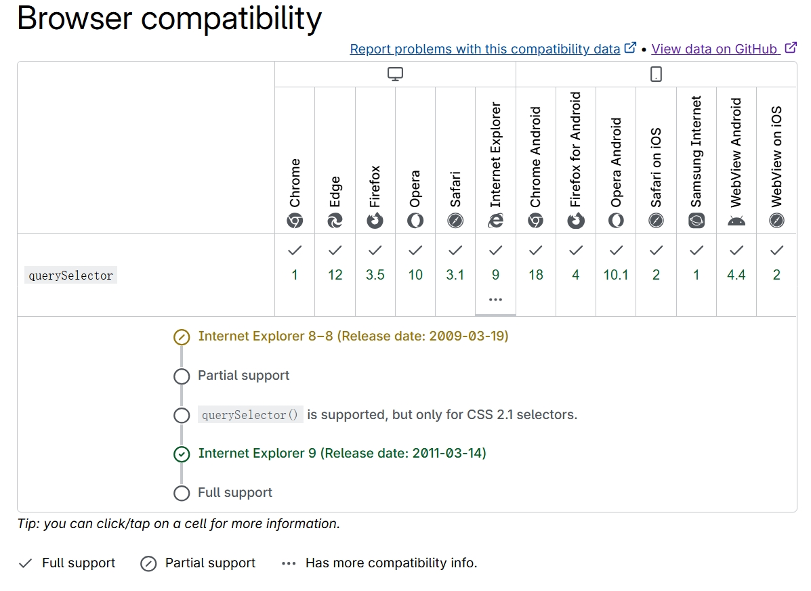
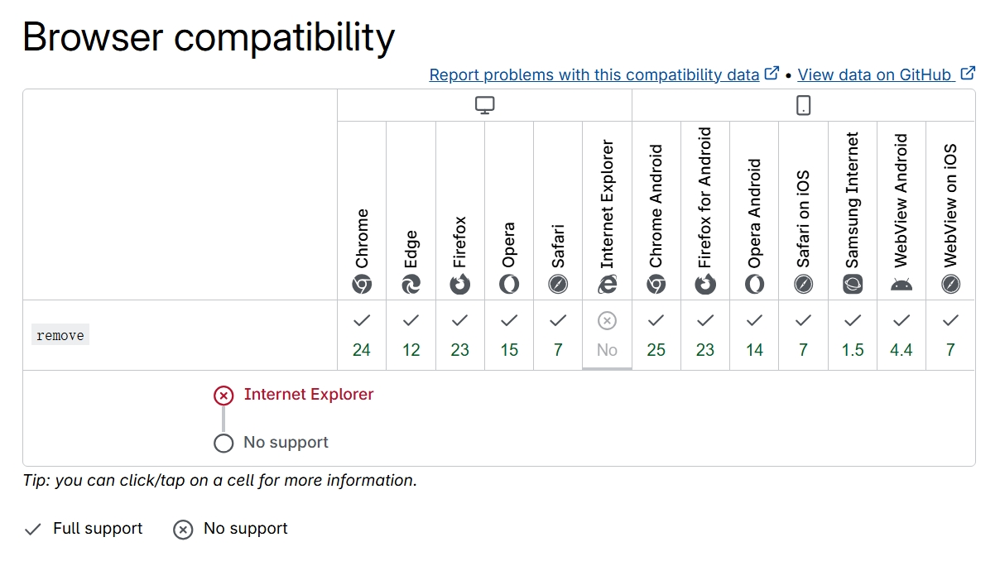

# MDN browser compatibility display IE

## Setup

Install TamperMonkey, then visit  
https://raw.githubusercontent.com/bddjr/MDN-browser-compatibility-display-IE/refs/heads/main/MDN-browser-compatibility-display-IE.user.js

## Preview

