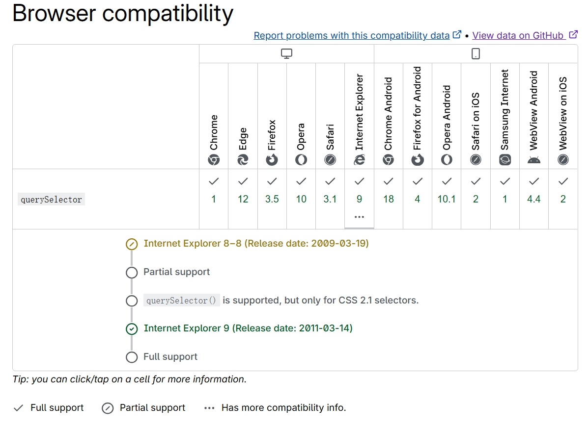
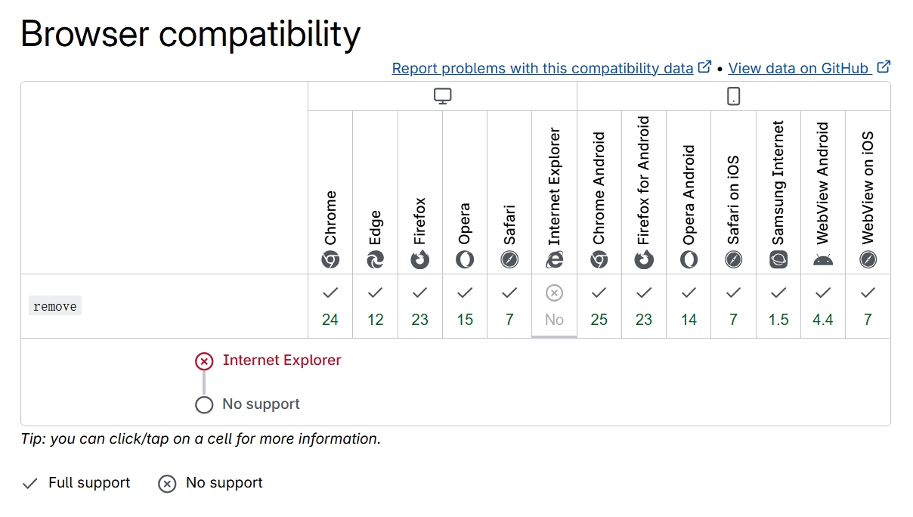

# MDN browser compatibility display IE

Make [MDN Web Docs](https://developer.mozilla.org)' "Browser compatibility" table display "Internet Explorer".

## Setup

Install [TamperMonkey](https://www.tampermonkey.net), then visit  
https://raw.githubusercontent.com/bddjr/MDN-browser-compatibility-display-IE/refs/heads/main/MDN-browser-compatibility-display-IE.user.js

## Preview

